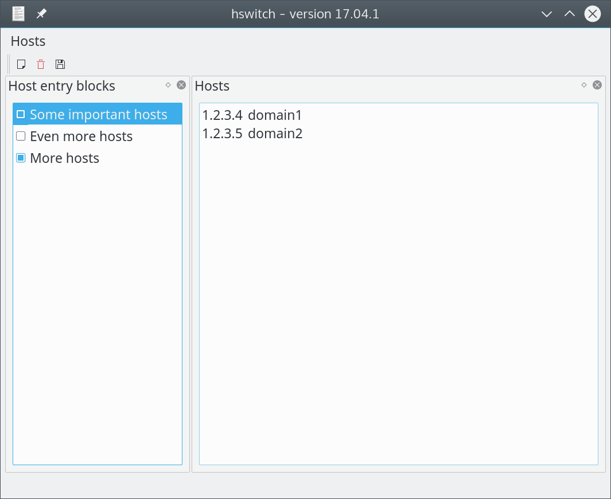

# hswitch

[Changelog](https://github.com/pbek/hswitch/blob/develop/CHANGELOG.md) | 
[Issues](https://github.com/pbek/hswitch/issues)

[](https://travis-ci.org/pbek/hswitch)

**hswitch** is a hosts file content switcher to modify your static ip addresses 
quickly for development.

It currently only works under Linux.

## Screenshot



## Todo

- Windows adaptions
    - icons
    - `sudo` and copy process replacement
    - different hosts file
    - packaging
- translation?

## Installation

- `snap install hswitch`
- run `hswitch`
    - since Qt snaps still seem to look atrocious under KDE you 
      alternatively might want to run `/snap/hswitch/current/usr/bin/hswitch`
      directly

## Building

To get the most current features you can build the application from the 
source code. Download the latest source here:
[Sources on GitHub as ZIP](https://github.com/pbek/hswitch/archive/develop.zip)

Alternatively you can also checkout the code directly from the git repository:


```shell
git clone https://github.com/pbek/hswitch.git -b master
cd hswitch
```

Then download [Qt Creator](http://www.qt.io/download-open-source), open the 
project file `src/hswitch.pro` and click on *Build / Build Project hswitch*.

Or you can build it directly in your terminal:

```shell
cd src
qmake
make
```

Please feel free to contribute source code to this project, make suggestions or
report troubles on the [issues page](https://github.com/pbek/hswitch/issues).

You can also visit [hswitch on GitHub](https://github.com/pbek/hswitch).
